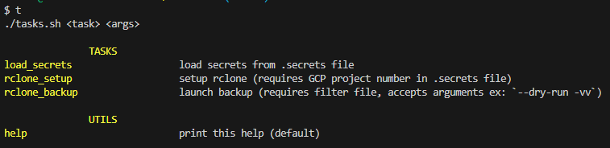

# Dotfiles

## Install

```sh
git clone https://github.com/VinceCabs/dotfiles.git ~/.dotfiles
cd ~/.dotfiles
echo GH_EMAIL=xxx@xxxxx.com > .secrets  ## Github email
sh ./dotapply.sh
```

## Tasks

[`tasks.sh`](tasks.sh) provides a task manager, inspired from (great) [Taskfile](https://github.com/adriancooney/Taskfile).

Run `tasks` or  `t` to show available tasks :



`tasks get_task_template` : get a *tasks.sh* template in local directory (useful)

## GCP Cloudshell favorite project

Set your favorite project for each session.

```sh
echo FAV_GCP_PROJECT=XXX >> .secrets
```

## Rclone backup

The following enables Rclone backup of any local source to a Google Storage location.

Setup:

```sh
cat >> .secrets << EOL

RCLONE_BACKUP_SOURCE_PATH=XXX  # absolute path to the source you want to backup
RCLONE_GOOGLE_STORAGE_PROJECT_NUMBER=XXX  # Google Cloud project number
RCLONE_GOOGLE_STORAGE_BUCKET=XXX  # Google Storage bucket name
EOL
tasks rclone_setup
```

Run backup:

```sh
tasks rclone_backup
```

*See [`tasks.sh`](tasks.sh) code and [rclone sync](https://rclone.org/commands/rclone_sync/) documentation for more details.*
